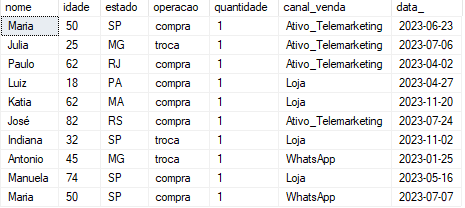

# case_1_linkedin_post

Um dataset pequeno e simples aqui para exercitar a capacidade de questionar e analisar padrões de dados. <br>

## Criação da tabela de exemplo.
Primeiramente, no SQL crie uma tabela com as seguintes colunas, conforme a seguir:
```
CREATE TABLE case_1 (

	[nome] VARCHAR(50),
	[idade] INT,
	[estado] VARCHAR(50),
	[operacao] VARCHAR(50),
	[quantidade] INT,
	[canal_venda] VARCHAR(50),
	[data_] DATE
	)
```
Em seguida clone este repositório.

Após criar a tabela e clonar o repositório, acesse o arquivo create_example.py, pois este contém o script que criará o Pandas Dataframe de exemplo e carregará os dados no SQL. 
Para executar o arquivo, siga os seguintes passos:
* 1 - Crie um ambiente virtual, usando o método de sua preferência. Aqui usei ***python -m venv*** e em seguida ative o ambiente virtual.
* 2 - Abra o terminal e acesse a pasta clonada.
* 3 - No terminal, execute ***pip install -r requirements.txt***, e com isso as dependências serão instaladas no ambiente virtual.

```
SELECT TOP (10) [nome]
      ,[idade]
      ,[estado]
      ,[operacao]
      ,[quantidade]
      ,[canal_venda]
      ,[data_]
  FROM [estudos].[dbo].[index_teste]
```
 <br>



A ideia aqui é responder a pergunta:  <br>
Qual faixa etária mais faz devoluções e trocas por estado e canal de compra?

Para responder essa pergunta e outras, vamos usar alguns recursos bem úteis e interassantes do SQL SERVER:  <br>
* CTE: "Especifica um conjunto de resultados nomeado temporário, conhecido como uma CTE (expressão de tabela comum). Ela é derivada de uma consulta simples e definida no escopo de execução de uma única instrução SELECT, INSERT, UPDATE, DELETE ou MERGE. Esta cláusula também pode ser usada em uma instrução CREATE VIEW como parte da instrução SELECT que a define. Uma expressão de tabela comum pode incluir referências a si mesma. É o que chamamos de expressão de tabela comum recursiva." [fonte site Microsoft](https://learn.microsoft.com/pt-br/sql/t-sql/queries/with-common-table-expression-transact-sql?view=sql-server-ver16) <br>
* Window Functions: Funções de agregação sobre partições definidas pelo usuário
* Builtin Functions: ROW_NUMBER, SUM, AVG, MAX

CTE: Aqui vamos utilizá-la para construir a análise em etapas. A sintaxe da CTE é bem simples, basta iniciar a consulta com WITH <nome de sua preferência> AS (Consulta).
Aqui a graça da utilização é poder recorrer a cada consulta criada em uma próxima consulta. No exemplo abaixo, pode-se ver que a consulta ***agregação*** é usada para gerar uma segunda consulta chamada ***analise_etaria***, e essa por sua vez é utilizada como inner join para a criação da ***OBT***. 
Sobre o uso da CTE, é importante mencionar que o resultado dos datasets é armazenado em memória, então em casos de consultas muito grandes e complexas é possível haver problemas de OOM (Out of memory); uma boa abordagem para utilizar CTE em consultas grandes e complexas é reduzir o tamanho do dataset através de filtragem. <br>
Aqui neste estudo o dataset é pequeno e por isso é possível explorar bem sua utilidade. Uma vantagem que particularmente gosto muito da CTE é a legibilidade facilitada, é possível reduzir a complexidade se compararmos com uma abordagem utilizando sub-queries.

Window Functions: Aqui foram utilizadas algumas agregações particionadas, por exemplo:

```
SUM([quantidade]) OVER (PARTITION BY estado,operacao,canal_venda) AS qt_estado_operacao_canal_venda
```
Acima está sendo somada a coluna quantidade particionando por estado, operação, e canal de venda. Pode-se acrescentar parâmetros que alterem o comportamento da agregação, mas nesse caso não houve necessidade. Vale a pena dar uma olhada na documentação, caso queira explorar mais opções. [Documentação](https://learn.microsoft.com/en-us/sql/t-sql/queries/select-window-transact-sql?view=sql-server-ver16)
Toda vez que notar uma função de agregação, como SUM, MAX, MIN seguida por OVER (PARTITION BY) ou (ORDER BY) trata-se de uma Window function.

```
WITH agregacao AS (
SELECT 

	ROW_NUMBER() OVER (ORDER BY nome) AS SK,
	[nome],
	[idade],
	[estado],
	[operacao],
	[quantidade],	
	[canal_venda],
	[data_],
	SUM([quantidade]) OVER (PARTITION BY nome) AS qt_cliente,
	SUM([quantidade]) OVER (PARTITION BY estado,operacao,canal_venda) AS qt_estado_operacao_canal_venda,
	SUM([quantidade]) OVER (PARTITION BY estado,operacao) AS qt_estado_operacao,
	SUM([quantidade]) OVER (PARTITION BY operacao,canal_venda) AS qt_operacao_canal_venda,
	SUM([quantidade]) OVER (PARTITION BY operacao) AS qt_operacao

FROM [dbo].[index_teste]
)


,

analise_etaria AS (

SELECT
	[sk],	
	AVG([idade]) OVER (PARTITION BY [estado]) AS idade_media_estado,
	(SELECT AVG([idade]) FROM [dbo].[index_teste]) AS idade_media_BR,
	CASE
		WHEN [idade] < 30 THEN '18 +' 
		WHEN [idade] < 40 THEN '30 +' 
		WHEN [idade] < 50 THEN '40 +' 
		WHEN [idade] < 60 THEN '50 +' 
		WHEN [idade] < 70 THEN '60 +' 
		WHEN [idade] < 80 THEN '70 +' 
		ELSE '80 +' 
	END AS faixa_etaria

FROM agregacao)
,

OBT AS (

SELECT

	a.SK,
	a.[nome],
	a.[idade],
	a.[estado],
	a.[operacao],
	a.[quantidade],	
	a.[canal_venda],
	CASE 
		WHEN MONTH(a.[data_]) < 4 then 'T 1'
		WHEN MONTH(a.[data_]) < 7 then 'T 2'
		WHEN MONTH(a.[data_]) < 10 then 'T 3'
		WHEN MONTH(a.[data_]) < 13 then 'T 4' END AS trimestre,

	a.qt_cliente,
	a.qt_estado_operacao_canal_venda,
	a.qt_estado_operacao,
	a.qt_operacao_canal_venda,
	a.qt_operacao,
	b.idade_media_estado,
	b.idade_media_BR,
	b.faixa_etaria

FROM agregacao a
INNER JOIN analise_etaria b ON 
a.SK = b.sk),

--Qual faixa et�ria mais faz devolu��es e trocas por estado e canal de compra?
devolucoes_trocas_por_canal_estado as (
SELECT 

	estado, 
	faixa_etaria, 
	compra,
	canal_venda,
	devolu��o,
	troca, 
	CAST((devolu��o+troca) AS DECIMAL(5,2)) / CAST(COMPRA AS DECIMAL(5,2))*100 AS percentual_trocas_devolucoes

FROM (
    SELECT estado, faixa_etaria, operacao,canal_venda, quantidade
    FROM OBT
	WHERE trimestre IN ('T 1','T 2','T 3','T 4')


) AS SourceTable
PIVOT  
(  
    SUM(quantidade)  
    FOR   
    operacao   

    IN ( [compra], [devolu��o],[troca])  
) AS pvt


)

	SELECT 
	
		TOP 10 * 
	
	FROM  devolucoes_trocas_por_canal_estado
	
	ORDER BY 
		percentual_trocas_devolucoes DESC
```

Esse último ***SELECT*** traz o top 10 ofensores de devoluções e trocas respondendo a pergunta feita no início. Caso consultar a tabela OBT, basta alterar o ***FROM*** e deletar o ***ORDER BY***
