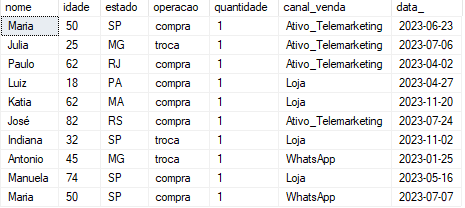

## Este repositório contém estudos voltados para análise de dados.  
Os dois primeiros cases de estudo se utilizam da mesma base como fonte e respondem a mesma pergunta.   

Qual faixa etária mais faz devoluções e trocas por estado e canal de compra?   

Repositório | Documentação
------------| ------------
case_1_SQL | [Readme](https://github.com/josecarlos-dataengineer/cases/blob/main/case_1_SQL/Case1.md)
case_2_Python |
